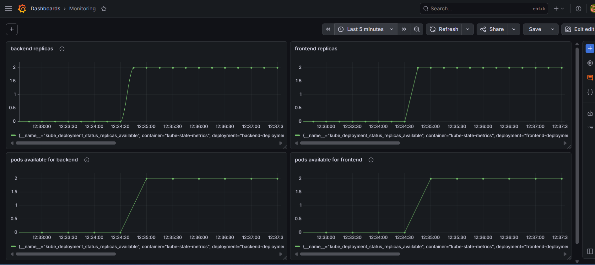

# 🏥 KubeHealth Monitor – Cloud Infrastructure Health Monitoring System

## 📌 Project Overview

KubeHealth Monitor is a cloud-native infrastructure monitoring platform designed to monitor the health, reliability, and performance of Kubernetes-based applications in real time.

The project integrates:

* Kubernetes
* Prometheus
* Grafana
* Docker
* AWS EC2

The platform continuously monitors:

* Pod health
* Deployment availability
* CPU utilization
* Memory usage
* Container restarts
* Cluster health
* Service availability

using Prometheus metrics visualized through Grafana dashboards.

---

# 🚀 Features

## ✅ Real-Time Infrastructure Monitoring

Tracks live Kubernetes metrics using Prometheus.

## ✅ Health Monitoring Dashboard

Displays:

* Healthy services
* Running pods
* Replica availability
* System resource usage

## ✅ Resource Monitoring

Monitors:

* CPU usage
* Memory usage
* Network traffic

## ✅ Service Reliability Monitoring

Tracks:

* Pod failures
* Container restarts
* Deployment availability

## ✅ Cloud-Native Deployment

Deployed using Kubernetes on AWS EC2.

---

# 🛠️ Tech Stack

| Technology | Purpose                 |
| ---------- | ----------------------- |
| Docker     | Containerization        |
| Kubernetes | Container orchestration |
| Prometheus | Metrics collection      |
| Grafana    | Data visualization      |
| AWS EC2    | Cloud hosting           |
| Linux      | Server environment      |

---

# 🏗️ System Architecture

## Architecture Flow

```text
Frontend/Backend Containers
            ↓
        Kubernetes
            ↓
       Prometheus
            ↓
         Grafana
            ↓
   Monitoring Dashboard
```

---

# 📂 Project Structure

```text
KubeHealth-Monitor/
│
├── frontend/
├── backend/
├── k8s/
│   ├── frontend-deployment.yml
│   ├── backend-deployment.yml
│   ├── services.yml
│
├── monitoring/
│   ├── prometheus
│   ├── grafana
│
└── README.md
```

---

# ⚙️ Kubernetes Deployment

## Backend Deployment Example

```yaml
apiVersion: apps/v1
kind: Deployment

metadata:
  name: backend-deployment

spec:
  replicas: 2

  selector:
    matchLabels:
      app: backend

  template:
    metadata:
      labels:
        app: backend

    spec:
      containers:
      - name: backend
        image: huntrixx/ocean-backend:latest
        ports:
        - containerPort: 5000
```

---

# 📊 Grafana Dashboard Metrics

## 🔹 Frontend Service Availability

```promql
kube_deployment_status_replicas_available{deployment="frontend-deployment"}
```

Tracks the number of available frontend replicas running in the Kubernetes cluster.

---

## 🔹 Backend Service Availability

```promql
kube_deployment_status_replicas_available{deployment="backend-deployment"}
```

Monitors backend deployment availability and reliability.

---

## 🔹 Frontend Active Pods

```promql
count(kube_pod_status_phase{phase="Running", pod=~".*frontend.*"})
```

Displays the number of healthy frontend pods currently running.

---

## 🔹 Backend Active Pods

```promql
count(kube_pod_status_phase{phase="Running", pod=~".*backend.*"})
```

Displays the number of healthy backend pods currently running.

---

## 🔹 Healthy Monitoring Targets

```promql
sum(up)
```

Shows the number of healthy monitoring targets currently being scraped by Prometheus.

---

## 🔹 CPU Usage Monitoring

```promql
sum(rate(container_cpu_usage_seconds_total[1m])) by (pod)
```

Tracks real-time CPU utilization of Kubernetes pods.

---

## 🔹 Memory Usage Monitoring

```promql
sum(container_memory_usage_bytes) by (pod)
```

Monitors memory consumption across running containers.

---

## 🔹 Restart Monitoring

```promql
sum(kube_pod_container_status_restarts_total)
```

Tracks container restart counts for identifying unstable services.

---

# 📷 Screenshots

## 🔹 Kubernetes Pods

> Add screenshot here

Example:

* `kubectl get pods -A`

---

## 🔹 Grafana Dashboard



Recommended panels:

* Healthy Targets
* Running Pods
* CPU Usage
* Memory Usage
* Replica Availability

---

## 🔹 Prometheus Targets

> Add Prometheus targets screenshot here

---

## 🔹 Node Monitoring

> Add node monitoring screenshot here

---

# 📈 Dashboard Highlights

The dashboard provides:

* Real-time cluster visibility
* Infrastructure health monitoring
* Pod availability tracking
* Resource utilization analysis
* Service reliability monitoring
* Failure detection

---

# 🎯 Use Cases

* Kubernetes monitoring
* Cloud infrastructure health tracking
* DevOps observability
* Service reliability monitoring
* Container resource analysis

---

# 🔥 Future Enhancements

* Alert manager integration
* Email/SMS alerts
* CI/CD pipeline monitoring
* Auto-scaling visualization
* Custom application metrics
* AI-based anomaly detection

---

# 🧠 Learning Outcomes

Through this project, I learned:

* Kubernetes deployment management
* Container orchestration
* Infrastructure monitoring
* Prometheus metrics collection
* Grafana dashboard creation
* Cloud-native monitoring concepts
* DevOps monitoring workflows

---

# 👨‍💻 Author

Drishti Jain

B.Tech CSE

Cloud & DevOps Project

---

# ⭐ Conclusion

KubeHealth Monitor demonstrates a real-time cloud infrastructure monitoring solution capable of tracking Kubernetes system health, deployment reliability, and resource utilization using Prometheus and Grafana.

The project reflects modern DevOps monitoring practices used in production cloud environments.
